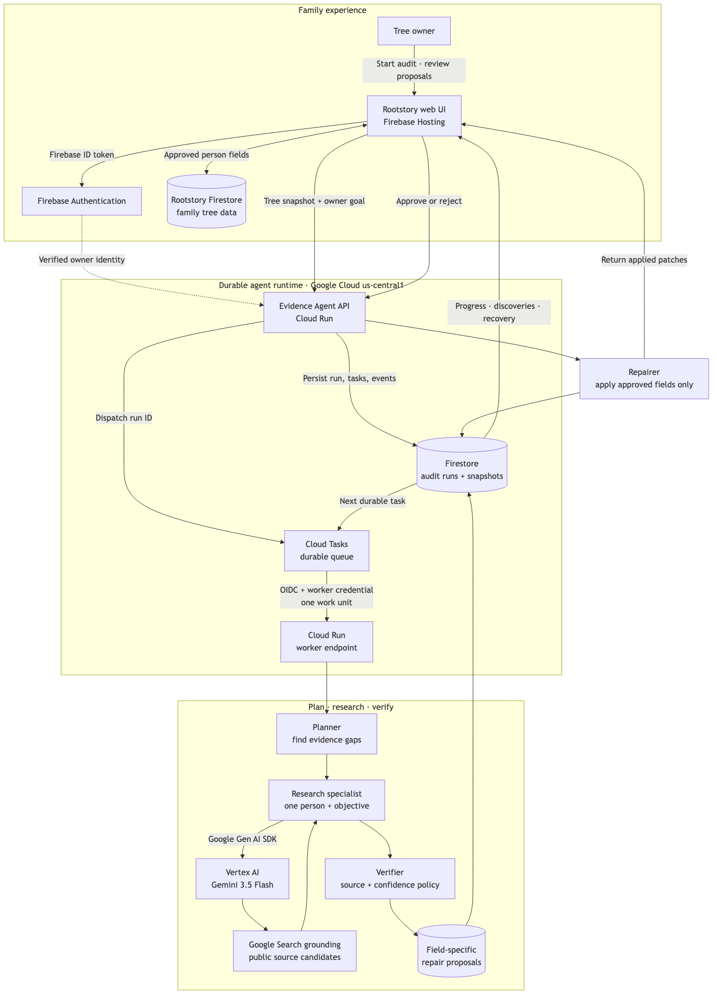

# Rootstory Evidence Agent

Rootstory Evidence Agent is an autonomous, event-driven family-tree auditor. A user gives it an
outcome—strengthen the evidence behind an existing tree—and it plans research tasks, delegates
source discovery, verifies claims, proposes reversible repairs, pauses for consequential human
decisions, and re-audits the result.

This repository was created for the 2026 All Things Agentic hackathon. The existing Rootstory
application is the host platform; the evidence-audit workflow in this repository is new work.

**Hackathon category:** The Taskmaster

**Hosted experience:** [rootstory.app](https://rootstory.app) (sign in, open a tree you own, and
choose **Evidence Agent**)

**Architecture:** [diagram and design notes](docs/ARCHITECTURE.md)



## Workflow

1. `POST /v1/audits` snapshots a tree and queues an audit.
2. The planner detects missing citations, incomplete facts, duplicates, and broken relationships.
3. Research tasks persist independently so failures do not erase progress.
4. A Gemini specialist performs grounded research and returns structured claims with sources.
5. The verifier rejects unsupported/low-confidence claims and creates explicit patch proposals.
6. Low-risk additions may be auto-applied when the owner opts in. Replacements and destructive
   changes require review.
7. The repairer applies approved patches with a complete event trail and recalculates evidence
   coverage.

There is no chatbot. Rootstory presents this state machine as an audit dashboard and evidence
review queue.

## Reproducible testing

### Prerequisites

- Python 3.12
- Git
- `curl` (optional, for the API walkthrough)
- Google Cloud CLI and a Google Cloud project only if enabling the live Gemini path

### 1. Clone, install, and run the automated tests

```bash
git clone https://github.com/pranuthi9/rootstory-evidence-agent.git
cd rootstory-evidence-agent
python3.12 -m venv .venv
source .venv/bin/activate
pip install -e '.[dev]'
ruff check .
ruff format --check .
pytest --cov=evidence_agent --cov-report=term-missing
```

The tests cover planning, durable task execution, authorization, source validation, proposal
creation, approval, repair application, and recovery of the latest audit for a tree.

### 2. Run the deterministic local service

The local default deliberately uses an in-memory store and a null researcher. It exercises the
complete state machine without credentials, network research, cloud charges, or fabricated
evidence.

```bash
cp .env.example .env
set -a
source .env
set +a
uvicorn evidence_agent.main:app --reload
```

In a second terminal:

```bash
curl http://127.0.0.1:8000/health

curl -X POST http://127.0.0.1:8000/v1/audits \
  -H 'Content-Type: application/json' \
  -H 'X-Rootstory-User: demo-owner' \
  -d '{
    "tree": {
      "id": "demo-tree",
      "owner_id": "demo-owner",
      "people": [{"id": "p1", "name": "Ada Lovelace"}],
      "relationships": []
    },
    "auto_apply_safe": false
  }'

curl 'http://127.0.0.1:8000/v1/audits?tree_id=demo-tree' \
  -H 'X-Rootstory-User: demo-owner'
```

Expected result: the run reaches `completed`, records its planner/researcher/verifier events, and
creates no evidence proposal because the safe null researcher never invents a source.

Interactive API documentation is available at <http://127.0.0.1:8000/docs>.

### 3. Enable real Gemini research

The live researcher uses the Google Gen AI SDK, Vertex AI, Gemini 3.5 Flash, and Google Search
grounding. Authenticate Application Default Credentials, then override the safe defaults:

```bash
gcloud auth application-default login
gcloud config set project YOUR_PROJECT_ID

export GOOGLE_CLOUD_PROJECT=YOUR_PROJECT_ID
export GOOGLE_CLOUD_LOCATION=global
export GOOGLE_GENAI_USE_VERTEXAI=True
export GEMINI_MODEL=gemini-3.5-flash
export EVIDENCE_RESEARCHER=gemini
export EVIDENCE_STORE=memory
export AUTH_MODE=header
export WORK_DISPATCH=background

uvicorn evidence_agent.main:app --reload
```

Repeat the API walkthrough above. Results depend on available public evidence and may correctly
contain zero proposals. A claim is eligible for a proposal only when it includes verified sources
and meets the confidence threshold.

### 4. Run the complete Rootstory UI locally

The user interface lives in the separate host repository:

```bash
git clone https://github.com/pranuthi9/rootstory.git
cd rootstory
pnpm install
```

Configure the Firebase web variables documented by that repository, set:

```bash
VITE_EVIDENCE_AGENT_URL=http://127.0.0.1:8000
```

Then run `pnpm dev`. Sign in, open a tree you own, and choose **Evidence Agent**. In local header
auth mode, the service validates the `X-Rootstory-User` owner identity supplied by the host UI.

### 5. Reproduce the Cloud Run deployment

The production deployment is automated by
[`.github/workflows/deploy.yml`](.github/workflows/deploy.yml). It uses GitHub Actions Workload
Identity Federation (no downloaded service-account key), runs all checks, deploys the container to
Cloud Run, and verifies the deployed `/health` response.

For a manual deployment after configuring the production environment variables and IAM resources:

```bash
gcloud run deploy rootstory-evidence-agent \
  --source . \
  --region us-central1 \
  --project YOUR_PROJECT_ID \
  --service-account YOUR_RUNTIME_SERVICE_ACCOUNT \
  --quiet

SERVICE_URL="$(gcloud run services describe rootstory-evidence-agent \
  --region us-central1 \
  --project YOUR_PROJECT_ID \
  --format='value(status.url)')"

curl "$SERVICE_URL/health"
```

Production additionally sets `EVIDENCE_STORE=firestore`, `EVIDENCE_RESEARCHER=gemini`,
`AUTH_MODE=firebase`, and `WORK_DISPATCH=cloud_tasks`. It supplies the queue name, service URL,
worker service account, and Secret Manager-backed worker token described in `.env.example`.

## API

- `POST /v1/audits` — start an audit
- `GET /v1/audits?tree_id={treeId}` — recover the owner's latest audit for a tree
- `GET /v1/audits/{runId}` — read current state, events, tasks, and proposals
- `POST /v1/internal/audits/{runId}/work` — execute one durable unit of work
- `POST /v1/audits/{runId}/proposals/{proposalId}/decision` — approve or reject
- `POST /v1/audits/{runId}/apply` — apply approved patches
- `GET /.well-known/agent.json` — agent discovery card

Use `EVIDENCE_STORE=firestore` and `WORK_DISPATCH=cloud_tasks` in production. Each Cloud Tasks
invocation performs one durable unit of research, persists the new state, and schedules the next
unit. A provider failure can therefore be retried without losing completed work.

Production uses Firebase ID-token verification (`AUTH_MODE=firebase`). Cloud Tasks sends both an
OIDC identity and a Secret Manager-backed worker credential to the internal work endpoint.

## Submission materials

- [Devpost project story](docs/DEVPOST_SUBMISSION.md)
- [Four-minute demo script](docs/DEMO_SCRIPT.md)
- [Architecture diagram](docs/ARCHITECTURE.md)
