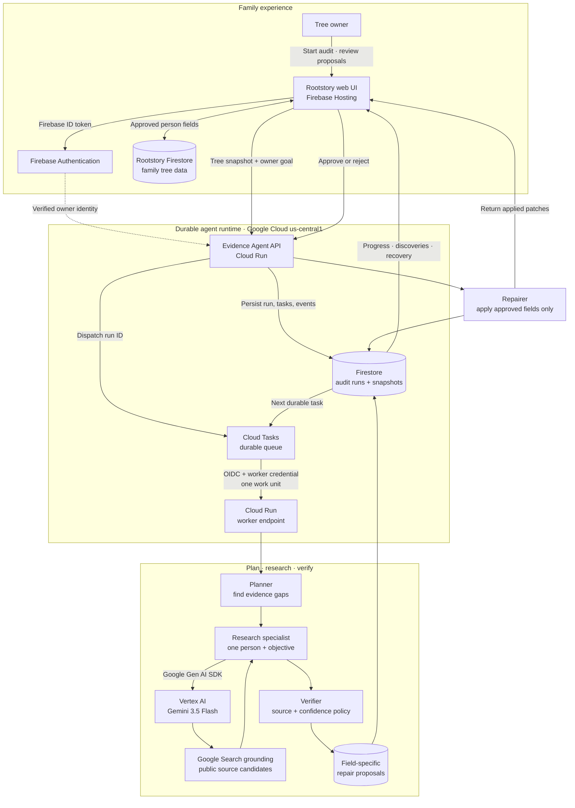

# Architecture

The Evidence Agent accepts one goal—strengthen an existing family tree—and owns the workflow
needed to reach it. Rootstory supplies identity, the selected tree snapshot, and human decisions;
it does not micromanage research prompts.

Downloadable versions: [PNG](architecture.png) · [SVG](architecture.svg)

## Durable state machine

`queued → auditing → researching → verifying → awaiting_review → applying → completed`

Every research task has its own status and attempt count. A worker processes only one queued task,
writes its claims and event record, then schedules the next invocation. This bounds request length,
makes progress visible, and allows Cloud Tasks to retry provider failures safely.

## Deployed components

- **Rootstory web UI:** Firebase Hosting at [rootstory.app](https://rootstory.app)
- **Identity:** Firebase Authentication; the service verifies the caller's ID token and tree owner
- **Agent runtime:** Cloud Run service `rootstory-evidence-agent`
- **Workflow dispatch:** Cloud Tasks queue `rootstory-evidence-audits`
- **Durable state:** Firestore audit runs, tree snapshots, tasks, events, and proposals
- **Model:** Gemini 3.5 Flash on Vertex AI through the Google Gen AI SDK
- **Retrieval:** Google Search grounding plus server-side validation of fallback public HTTPS pages
- **Secrets and deployment:** Secret Manager-backed worker credential and GitHub Actions Workload
  Identity Federation

## Mutation policy

- Researchers return claims and citations, never database mutations.
- The verifier rejects claims without canonical HTTPS sources or below the confidence threshold.
- Additive citation patches may be auto-applied only when the owner explicitly opts in.
- Replacements, merges, deletions, relationship changes, conflicts, and sensitive facts require
  human approval.
- Each proposal stores its previous value and sources, making the decision auditable and reversible.

## Trust boundaries

- Public users cannot start or read an audit; the current workflow is restricted to the tree owner.
- The model produces candidate claims, never direct database writes.
- Grounded URLs are retained only after source and confidence checks.
- Cloud Tasks sends an OIDC identity; the internal worker endpoint also validates a separate worker
  credential before processing work.
- The UI explains the exact person and field affected before the owner applies selected evidence.
