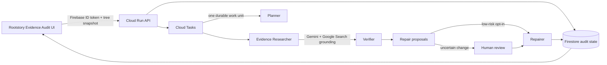

# Architecture

The Evidence Agent accepts one goal—strengthen an existing family tree—and owns the workflow
needed to reach it. Rootstory supplies identity, the selected tree snapshot, and human decisions;
it does not micromanage research prompts.

## Durable state machine

`queued → auditing → researching → verifying → awaiting_review → applying → completed`

Every research task has its own status and attempt count. A worker processes only one queued task,
writes its claims and event record, then schedules the next invocation. This bounds request length,
makes progress visible, and allows Cloud Tasks to retry provider failures safely.

## Mutation policy

- Researchers return claims and citations, never database mutations.
- The verifier rejects claims without canonical HTTPS sources or below the confidence threshold.
- Additive citation patches may be auto-applied only when the owner explicitly opts in.
- Replacements, merges, deletions, relationship changes, conflicts, and sensitive facts require
  human approval.
- Each proposal stores its previous value and sources, making the decision auditable and reversible.

